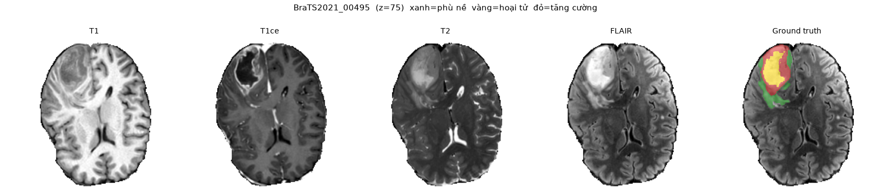

# 01 — Giải thích đề tài (đọc file này trước)

## 1. Đề tài trong 3 câu

1. **Bài toán:** cho ảnh **MRI não 3D** của bệnh nhân có khối u, máy tự **tô màu từng voxel** xem đó là mô não bình thường hay thuộc phần nào của khối u.
2. **Mô hình tham khảo:** **3D TransUNet** (paper arXiv:2310.07781) = mạng **U-Net** (CNN) kết hợp **Transformer**.
3. **Việc của nhóm:** tự cài đặt lại mô hình (bản 2D trước, 3D thu nhỏ sau cho vừa GPU 4 GB), train trên bộ dữ liệu **BraTS2021**, đo độ chính xác bằng **Dice**, so với U-Net thường và với số liệu trong paper.


*Một lát cắt của ca BraTS2021_00495. 4 ảnh đầu là 4 loại MRI; ảnh cuối là nhãn do bác sĩ vẽ. Xanh = phù nề, vàng = hoại tử, đỏ = vùng tăng cường.*

Loại bài toán này gọi là **semantic segmentation** (phân vùng ngữ nghĩa) trên ảnh y tế 3D. Nó khác với:

- **classification** (phân loại): cả ảnh chỉ có 1 nhãn, ví dụ "có u / không u";
- **detection** (phát hiện): vẽ khung chữ nhật quanh khối u.

---

## 2. Thuật ngữ y khoa

| Thuật ngữ | Giải thích dễ hiểu |
|---|---|
| **MRI** (chụp cộng hưởng từ) | Chụp cơ thể bằng từ trường, cho ảnh **3D** gồm nhiều lát cắt xếp chồng. Mỗi điểm ảnh 3D gọi là **voxel** (như pixel nhưng có thể tích). |
| **Glioma / u thần kinh đệm** | Loại u não nguyên phát phổ biến. BraTS tập trung vào loại này. |
| **Sequence / modality** (chuỗi xung) | Cùng 1 bệnh nhân được chụp nhiều kiểu, mỗi kiểu làm nổi bật mô khác nhau. Có thể coi như 4 "kênh màu" của ảnh. |
| **T1** | Ảnh giải phẫu, thấy rõ cấu trúc não. |
| **T1ce / T1Gd** (T1 có tiêm thuốc cản quang Gadolinium) | Vùng u còn hoạt động (mạch máu bị phá) **sáng lên**. Dùng để thấy **ET**. |
| **T2** | Dịch và phù nề hiện sáng. |
| **FLAIR** | Giống T2 nhưng dịch não tủy bị tối đi, nên **vùng phù nề quanh u** nổi rõ. Dùng để thấy **WT**. |
| **NCR** (necrotic tumor core) | Lõi **hoại tử** (mô chết) bên trong u. Nhãn gốc = `1`. |
| **ED** (peritumoral edema) | **Phù nề** quanh u (mô sưng, thấm dịch). Nhãn gốc = `2`. |
| **ET** (GD-enhancing tumor) | Phần u **tăng cường** thuốc cản quang, tức phần u đang hoạt động mạnh. Nhãn gốc = `4` (không có nhãn 3). |
| **WT** (whole tumor) | Toàn bộ vùng bệnh = NCR + ED + ET. |
| **TC** (tumor core) | Lõi u = NCR + ET (bỏ phù nề). Thường là phần bác sĩ phẫu thuật cắt bỏ. |
| **Skull-stripping** | Đã xoá hộp sọ khỏi ảnh, chỉ giữ não. Vì vậy nền ảnh = 0. |
| **Co-registration** | 4 loại MRI đã được căn chỉnh trùng khít, voxel (x,y,z) ở 4 ảnh là cùng một điểm trong não. |
| **Isotropic 1 mm³** | Mỗi voxel là khối lập phương 1×1×1 mm. |
| **Ground truth / annotation** | Nhãn "đáp án" do 1–4 người vẽ tay, bác sĩ chẩn đoán hình ảnh thần kinh (neuro-radiologist) duyệt. |

**Ba vùng lồng nhau (quan trọng nhất):**

```
┌────────────────────────── WT = 1 + 2 + 4 ──────────────┐
│   phù nề (ED, 2)                                       │
│     ┌────────────── TC = 1 + 4 ───────────────┐        │
│     │  hoại tử (NCR, 1)                       │        │
│     │     ┌──── ET = 4 ────┐                  │        │
│     │     │  tăng cường    │                  │        │
│     │     └────────────────┘                  │        │
│     └─────────────────────────────────────────┘        │
└────────────────────────────────────────────────────────┘
```

BraTS **chấm điểm theo 3 vùng WT, TC, ET**, không chấm theo từng nhãn 1/2/4. Vì vậy code của mình cũng dự đoán trực tiếp 3 vùng này.

---

## 3. Thuật ngữ AI / thị giác máy tính

### 3.1 Cơ bản

| Thuật ngữ | Giải thích |
|---|---|
| **Tensor shape (B, C, H, W)** | B = số mẫu trong 1 batch, C = số kênh, H×W = kích thước. Ảnh 3D thêm 1 chiều: (B, C, D, H, W). |
| **CNN** (mạng tích chập) | Mạng dùng bộ lọc nhỏ (3×3 hoặc 3×3×3) trượt trên ảnh. Giỏi bắt chi tiết **cục bộ** (cạnh, vân), kém bắt quan hệ **xa**. |
| **Encoder / Decoder** | Encoder thu nhỏ ảnh dần, trích **đặc trưng** (feature) trừu tượng. Decoder phóng to lại để ra bản đồ nhãn cùng kích thước ảnh. |
| **Skip connection** | Đường nối tắt đưa feature độ phân giải cao từ encoder sang decoder, giúp giữ chi tiết biên. |
| **U-Net** | Kiến trúc encoder–decoder đối xứng có skip connection, vẽ ra có hình chữ **U**. Là chuẩn mực cho phân vùng ảnh y tế (2015). |
| **nnU-Net** | "no-new-U-Net": framework tự động chọn cấu hình U-Net (patch, số tầng, tiền xử lý, augmentation) theo dữ liệu. Rất mạnh, hay thắng các cuộc thi. 3D TransUNet xây trên nền này. |
| **Feature map** | Output trung gian của 1 tầng mạng, ví dụ (B, 128, 40, 40). |
| **Sigmoid / Softmax** | Sigmoid: mỗi kênh là 1 xác suất độc lập 0–1, dùng được khi các vùng **chồng nhau** (WT ⊃ TC ⊃ ET). Softmax: các lớp loại trừ nhau, tổng bằng 1. |
| **Patch / crop** | Cắt khối nhỏ (ví dụ 160×160 hoặc 96³) để train cho vừa VRAM. |
| **Sliding window inference** | Lúc dự đoán cả ảnh lớn: trượt cửa sổ bằng kích thước patch, chồng lấn nhau, rồi ghép kết quả. |
| **Data augmentation** | Biến đổi ngẫu nhiên (lật, xoay, đổi độ sáng, thêm nhiễu) để mô hình đỡ học vẹt. |
| **Epoch / iteration / batch** | Iteration = 1 lần cập nhật trọng số với 1 batch. Trong code này 1 epoch = số iteration cố định (mặc định 250), không phải "duyệt hết dữ liệu". |
| **Train / Val / Test** | Train: để học. Val: để chọn checkpoint và tinh chỉnh. Test: chỉ dùng 1 lần cuối để báo cáo. **Chia theo bệnh nhân**, không chia theo lát cắt, vì lát cắt kề nhau gần như giống hệt nhau. |
| **K-fold cross-validation** | Chia dữ liệu thành K phần, lần lượt lấy mỗi phần làm val. Paper dùng 5-fold; nhóm mình dùng train/val/test cố định cho nhẹ. |
| **AMP** (mixed precision) | Tính bằng số thực 16-bit thay vì 32-bit: gần như giảm nửa VRAM, nhanh hơn. |
| **Gradient accumulation** | Cộng dồn gradient qua nhiều batch nhỏ rồi mới cập nhật, giả lập batch lớn khi VRAM ít. |

### 3.2 Transformer

| Thuật ngữ | Giải thích |
|---|---|
| **Token** | 1 phần tử của chuỗi đầu vào Transformer. Với ảnh: mỗi patch hoặc mỗi vị trí trên feature map là 1 token (vector). |
| **Self-attention** | Mỗi token nhìn **tất cả** token khác, rồi tổng hợp theo trọng số "liên quan". Nhờ vậy bắt được quan hệ **toàn cục**, thứ CNN làm kém. Chi phí tăng theo bình phương số token. |
| **Query / Key / Value** | Attention = so khớp Query với các Key, rồi lấy trung bình có trọng số các Value. |
| **Cross-attention** | Query lấy từ chuỗi A, Key/Value lấy từ chuỗi B. Ví dụ: "query khối u" nhìn vào feature ảnh. |
| **Positional encoding** | Thêm thông tin vị trí vào token, vì bản thân attention không biết thứ tự. |
| **ViT** (Vision Transformer) | Chia ảnh thành patch, mỗi patch thành 1 token, rồi đưa qua chuỗi lớp self-attention. |
| **TransUNet** (2021) | Cùng nhóm tác giả: đặt ViT ở đáy (bottleneck) của U-Net. **3D TransUNet** (2023) mở rộng sang 3D và thêm Transformer ở decoder. |
| **Mask classification** | Thay vì phân loại từng voxel, mô hình sinh ra **N mask** kèm **N nhãn lớp** (kiểu DETR / Mask2Former). |
| **Object / organ query** | N vector học được, mỗi vector "đại diện" cho 1 vùng cần tìm (ví dụ vùng ET). N = 20, nhiều hơn số lớp (3). |
| **Masked attention (coarse-to-fine)** | Query chỉ được nhìn vào **vùng mask nó vừa đoán** ở vòng trước. Qua mỗi vòng, vùng khoanh được tinh chỉnh dần: thô, rồi mịn. |
| **Hungarian matching** | Có 20 dự đoán nhưng chỉ ≤ 3 vùng thật, cần biết dự đoán nào "phụ trách" vùng nào. Thuật toán Hungarian ghép cặp 1-1 sao cho tổng sai số nhỏ nhất. Dự đoán không được ghép phải học nhãn "không có gì". |
| **Deep supervision** | Tính loss ở cả các output trung gian, không chỉ output cuối. Giúp mạng sâu học ổn định. |

### 3.3 Đo lường

| Thuật ngữ | Giải thích |
|---|---|
| **Dice score** | 2·∣P∩G∣ / (∣P∣ + ∣G∣), từ 0 (sai hoàn toàn) đến 1 (trùng khít). Thước đo chính của BraTS. Tính riêng cho WT, TC, ET trên **cả volume**. |
| **HD95** (Hausdorff 95%) | Khoảng cách (mm) giữa biên dự đoán và biên thật, bỏ 5% điểm xa nhất. Càng nhỏ càng tốt. Đo độ lệch biên. |
| **BCE** (binary cross-entropy) | Loss từng voxel cho bài toán nhị phân. |
| **Dice loss** | `1 − Dice` (bản "mềm" dùng xác suất). Chống mất cân bằng lớp: u chỉ chiếm khoảng 1% thể tích. |

---

## 4. BraTS và bộ dữ liệu

**BraTS** (Brain Tumor Segmentation Challenge) là cuộc thi phân vùng u não thường niên tại hội nghị MICCAI, từ 2012. **BraTS2021** là phiên bản lớn nhất lúc đó: **1251 ca train có nhãn**. Các ca val/test của cuộc thi không kèm nhãn, nên nhóm chỉ dùng 1251 ca này và tự chia train/val/test.

### 4.1 Cấu trúc file

```
Data/
├── BraTS2021_Training_Data.tar          ← ~13 GB, tar KHÔNG nén ngoài (bên trong mỗi file tự nén .gz)
│   ├── BraTS2021_00000/
│   │   ├── BraTS2021_00000_t1.nii.gz    ← MRI T1      (240×240×155, int16)
│   │   ├── BraTS2021_00000_t1ce.nii.gz  ← MRI T1ce
│   │   ├── BraTS2021_00000_t2.nii.gz    ← MRI T2
│   │   ├── BraTS2021_00000_flair.nii.gz ← MRI FLAIR
│   │   └── BraTS2021_00000_seg.nii.gz   ← NHÃN        (240×240×155, giá trị 0/1/2/4)
│   ├── BraTS2021_00002/ ...
│   └── ... (1251 thư mục = 6255 file)
├── BraTS2021_00495.tar                  ← 2 ca lẻ (5 file, không có thư mục con), dùng để thử code
└── BraTS2021_00621.tar
```

Mã ca `BraTS2021_XXXXX` không liên tục (có số bị bỏ qua). Đó là bình thường.

### 4.2 Định dạng NIfTI (`.nii.gz`)

- Định dạng chuẩn của ảnh y tế nghiên cứu. `.nii` = **header** (kích thước, kích thước voxel, ma trận **affine** ánh xạ voxel sang toạ độ thật) + **mảng 3D**. `.gz` = nén gzip.
- Đọc bằng Python: `nibabel.load(path).get_fdata()` hoặc SimpleITK. Xem bằng mắt: **ITK-SNAP** hoặc **3D Slicer** (miễn phí), mở ảnh FLAIR rồi mở file seg làm lớp nhãn.
- Trục của mảng: `(x, y, z)` = (trái–phải, trước–sau, dưới–trên). Lát cắt **axial** (nằm ngang) là `volume[:, :, z]`.

### 4.3 Nội dung 1 ca

| File | Shape | Kiểu | Giá trị |
|---|---|---|---|
| t1, t1ce, t2, flair | 240×240×155 | int16 (đa số) hoặc float32 (191 ca) | 0 ở nền, trong não vài trăm đến vài nghìn. **Không có đơn vị chuẩn**, mỗi máy chụp mỗi khác, nên phải chuẩn hóa |
| seg | 240×240×155 | uint8 / uint16 / int16 tùy ca | 0 = nền và não lành, 1 = NCR, 2 = ED, 4 = ET |

Kiểu dữ liệu không đồng nhất giữa các ca là bình thường; `nibabel` đọc kiểu nào cũng được và code của nhóm ép về `float32` (ảnh) và `uint8` (nhãn).

### 4.4 Kết quả kiểm tra toàn bộ dữ liệu (`scripts/check_data.py`)

Đã quét **6255 file của 1251 ca** (header của ảnh + đọc đầy đủ file nhãn):

- **Không có file hỏng**, header NIfTI hợp lệ hết.
- **Mọi ca đều 240×240×155, voxel 1×1×1 mm** — không cần resample.
- Nhãn chỉ gồm đúng **{0, 1, 2, 4}**, không có giá trị lạ.
- Nền đúng bằng 0 tuyệt đối (kể cả ảnh float32), nên cắt theo vùng não bằng "khác 0" là an toàn.

Tỉ lệ thể tích (trên toàn ảnh 240×240×155):

| Vùng | Trung bình | Trung vị | Nhỏ nhất | Lớn nhất | Số ca rỗng |
|---|---|---|---|---|---|
| NCR (1) | 0.160% | 0.083% | 0% | 2.12% | **43** |
| ED (2) | 0.674% | 0.586% | 0% | 2.42% | 1 |
| ET (4) | 0.240% | 0.194% | 0% | 1.25% | **33** |
| WT | 1.075% | 1.001% | 0.03% | 4.05% | 0 |
| TC | 0.400% | 0.317% | 0% | 2.13% | 6 |

Thể tích trung bình: WT ≈ 96 cm³, TC ≈ 36 cm³, ET ≈ 21 cm³ (voxel 1 mm³).

**Ba điều rút ra:**

1. **Mất cân bằng rất nặng** (u ≈ 1% thể tích) → dùng Dice loss và lấy mẫu thiên về vùng có u, không dùng accuracy.
2. **33 ca không có ET và 6 ca không có TC.** Với các ca đó, Dice chỉ có nghĩa theo quy ước BraTS: dự đoán rỗng và nhãn rỗng thì tính 1.0, dự đoán có mà nhãn rỗng thì tính 0.0. Đây cũng là lý do điểm ET của mọi phương pháp thường thấp hơn WT.
3. **Ca nhỏ nhất chỉ có 2808 voxel u** (0.03%) — mô hình dễ bỏ sót hoàn toàn, nên khi phân tích lỗi phải xem riêng nhóm u nhỏ.

## 5. Input và Output của mô hình

```
                  ┌─────────────── TIỀN XỬ LÝ (src/brats/preprocess.py) ───────────────┐
4 file MRI  ──►   │ ghép 4 kênh → crop vùng não (~140×175×140) → chuẩn hóa z-score     │
1 file seg  ──►   │ nhãn {0,1,2,4} → 3 kênh nhị phân [WT, TC, ET]                       │
                  └─────────────────────────────────────────────────────────────────────┘
                                   │
         ┌─────────────────────────┴───────────────────────────┐
     BẢN 2D (lát cắt axial)                              BẢN 3D (khối)
  INPUT : (B, 4, 160, 160)                          INPUT : (B, 4, 96, 96, 96)
  NHÃN  : (B, 3, 160, 160)  0/1                     NHÃN  : (B, 3, 96, 96, 96)
         │                                                   │
         ▼                     MÔ HÌNH                       ▼
  U-Net:      logits (B, 3, H, W)  ── sigmoid ──►  xác suất 3 vùng
  TransUNet:  pred_logits (B, 20, 4)    = mỗi query thuộc WT/TC/ET/"không gì"
              pred_masks  (B, 20, H, W) = mask của mỗi query
              ──► xác suất vùng c = Σ_q  P(lớp c | q) · sigmoid(mask_q)  ──► (B, 3, H, W)
         │
         ▼   HẬU XỬ LÝ (src/brats/inference.py)
  ngưỡng 0.5 → ép lồng nhau (ET ⊂ TC ⊂ WT) → ghép lại cả volume → trả về kích thước 240×240×155
         │
         ▼
  OUTPUT CUỐI: file BraTS2021_XXXXX_pred.nii.gz, cùng định dạng file seg (0/1/2/4)
  ĐIỂM: Dice WT, Dice TC, Dice ET (+ HD95) so với file seg thật
```

**Tại sao bắt đầu bằng 2D?** GPU có 4 GB. Bản 3D gốc (patch 128³, batch 2) cần khoảng 24 GB. Bản 2D coi mỗi lát cắt là 1 ảnh, train nhanh và vừa VRAM, nhưng mất ngữ cảnh theo trục z. Bản 3D thu nhỏ (patch 96³, ít kênh) gần paper hơn nhưng chậm.

---

## 6. Mô hình 3D TransUNet

Paper đưa ra 3 cách chèn Transformer vào U-Net:

| Cấu hình | Làm gì | Hợp với | File config của mình |
|---|---|---|---|
| **Encoder-only** | ViT ở đáy U-Net, học quan hệ toàn cục giữa các vùng | Nhiều cơ quan cùng lúc | `transunet2d_encoder.yaml` |
| **Decoder-only** ⭐ | U-Net thường + **Transformer decoder** gồm 20 query, masked attention, Hungarian loss | **U nhỏ và khó (BraTS)** | `transunet2d.yaml`, `transunet3d_small.yaml` |
| Encoder + Decoder | Cả hai | Không tốt hơn rõ | bật `vit_bottleneck` trong `transunet2d.yaml` |

**Decoder-only hoạt động thế nào (hình dung):**

1. U-Net chạy bình thường, lấy ra feature ở 4 mức phân giải.
2. 20 query ban đầu đoán thô: "query 7 nghĩ ET nằm khoảng chỗ này".
3. **Vòng 1–3:** mỗi query dùng cross-attention nhìn vào feature U-Net, **chỉ trong vùng nó vừa đoán** (masked attention); các query trao đổi với nhau (self-attention); rồi đoán lại mask mịn hơn.
4. Cuối cùng, mỗi query cho ra 1 mask và 1 nhãn (WT/TC/ET/không gì). Gộp lại được bản đồ 3 vùng.
5. Khi train, thuật toán Hungarian ghép query với vùng thật để tính loss. Loss tính ở cả 4 lần đoán (deep supervision).

**Kết quả paper trên BraTS2021** (Dice %, 5-fold, 3D đầy đủ, 8 GPU):

| Method | ET | TC | WT | TB |
|---|---|---|---|---|
| nnU-Net | 88.05 | 91.92 | 93.79 | 91.25 |
| **3D TransUNet** | **88.85** | **92.48** | **93.90** | **91.74** |

Mức cải thiện chỉ khoảng +0.5%. Với bản 2D hoặc 3D thu nhỏ trên GPU 4 GB, **không kỳ vọng đạt số này**. Mục tiêu hợp lý: chạy được, có kết quả hợp lý (WT khoảng 0.85–0.90), và so sánh công bằng giữa U-Net với TransUNet **trong cùng điều kiện**.

---

## 7. Việc cần làm (tóm tắt)

1. Setup Python + GPU trên Windows (`docs/02`, mục 2).
2. Tải xong data, tạo index tar, chia train/val/test.
3. Train **U-Net 2D** (baseline), rồi **TransUNet 2D decoder-only**. So sánh.
4. Thử biến thể: tắt masked attention, đổi số query, encoder-only.
5. Làm bản **3D thu nhỏ** (U-Net 3D và TransUNet 3D).
6. Đánh giá trên test (Dice, HD95), vẽ hình, phân tích lỗi, viết báo cáo.

## 8. Câu hỏi giảng viên có thể hỏi

- *Tại sao không dùng accuracy?* → Nền chiếm ~99%. Đoán toàn bộ là nền cũng được 99% accuracy. Dice chỉ quan tâm vùng u.
- *Tại sao 4 modality?* → Mỗi modality lộ rõ một phần u: FLAIR cho phù nề, T1ce cho vùng tăng cường.
- *Tại sao sigmoid 3 kênh mà không softmax 4 lớp?* → Vì cách chấm là 3 vùng lồng nhau; dự đoán thẳng vùng thì tối ưu đúng mục tiêu.
- *Tại sao N query > số lớp?* → Paper: giảm bỏ sót (false negative), mỗi lớp có nhiều ứng viên.
- *2D khác 3D thế nào?* → 2D nhanh, nhẹ, nhưng không thấy lát trên/dưới nên dễ đứt đoạn theo trục z.
- *Có rò rỉ dữ liệu không?* → Chia theo bệnh nhân, file `data/splits.json` cố định seed.
